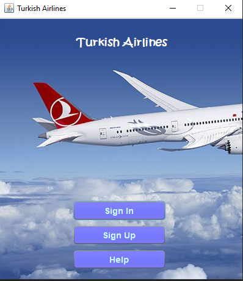
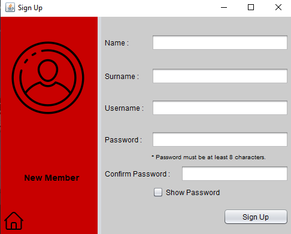
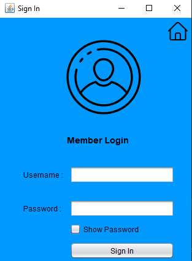
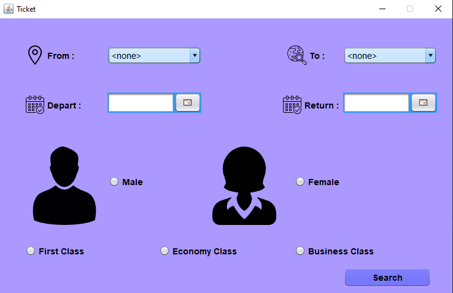

# AIRLINE RESERVATION SYSTEM
> This program is an application to buy airline tickets from Turkish Airline.

[![Java Version][java-image]][java-url]
[![Jdk Version][jdk-image]][jdk-url]
[![Swing Lib][swing-image]][swing-url]
[![MySQL Database][mysql-image]][mysql-url]

First of all, you must create a table called 'users' in the MySQL database. The table must contain columns with the names 'id, name, surname, username, password'. And you should add at least one sample user so that we can sign in. (Or you do not add if you want, but you will need to sign up first.) Please pay attention to the naming, otherwise the program may not work.

Then, in order for this program to work, you need to edit the variables (userName, password, databaseName, host, port) in the Database.java file for database operations.

## Usage Example

First, when we run the file named HomeScreen.java, this screen will appear.

If we want to sign up, we can click the sign up button and go to that screen.

And then we can sign in to buy tickets.

The program will direct us to the ticket screen when we sign in.

Then we can complete the ticket information and finalize the ticket purchase.

Have a nice try!

If you run into a problem, you can let me know here or on my Twitter account. - [@Mehmetkaragoz07](https://twitter.com/Mehmetkaragoz07) - karagoz.mhmtg@gmail.com

https://github.com/mehmet-karagoz

[java-image]: https://img.shields.io/badge/java-v15.0.1-orange
[java-url]: https://www.java.com/tr/
[jdk-image]: https://img.shields.io/badge/jdk-v15.0.1-yellow
[jdk-url]: https://www.oracle.com/tr/java/technologies/javase-downloads.html
[swing-image]: https://img.shields.io/badge/swing-gui-green
[swing-url]: https://docs.oracle.com/javase/tutorial/uiswing/index.html
[mysql-image]: https://img.shields.io/badge/mysql-db-blue
[mysql-url]: https://www.mysql.com
